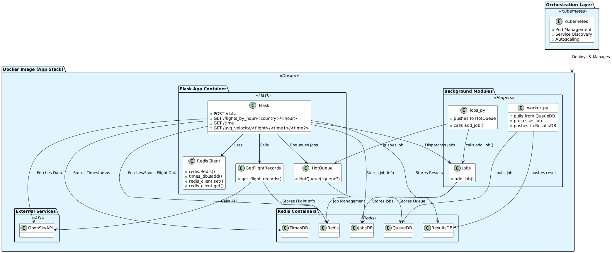

# OpenSky Flight Data API
## Organize instructions for local/Kubernetes usage

## Introduction
This project provides a Flask-based API that ingests real-time aviation data from the [OpenSky Network API](https://openskynetwork.github.io/opensky-api/rest.html#all-state-vectors), stores the information in a Redis database, and enables querying, filtering, and job-based processing of flight data. It also supports visualization of aircraft positions within altitude ranges using background workers and geospatial mapping.

## Installation and Dependencies
This project uses the following dependencies:
- **Flask**: For building the REST API.
- **Redis**: In-memory data store for storing flights, jobs, and results.
- **HotQueue**: Queue system backed by Redis for job management.
- **Requests**: For pulling data from the OpenSky API.
- **Matplotlib + Cartopy**: To visualize aircraft positions on world maps.
- **pytest**: For unit and integration testing.

All dependencies can be found in `requirements.txt`.

## Instructions
### 1. Build and Start the Containerized Environment
```bash
docker-compose up --build -d
```

### 2. Run Redis Connection
```bash
docker exec -it <redis-container-id> redis-cli
```

### 3. Stop the Environment
```bash
docker-compose down
```

### 4. Viewing Worker Logs
```bash
docker-compose logs worker
```

## File Descriptions

### `api.py`
This is the main application file that defines all the Flask API routes and logic for interacting with flight data, Redis, and job processing.

#### Functions

- **get_flight_records()**: Fetches live flight data from the OpenSky Network API and returns it with the current timestamp.

- **load_data()**: Pulls flight data from the OpenSky API, parses each flight's information, and stores it in Redis along with the corresponding timestamp.

- **delete_data(hour: int)**: Deletes all flight data stored in Redis under the specified hour timestamp and removes the timestamp from the tracked set.

- **flights_by_hour(country: str, hour: int)**: Returns the total number of flights originating from a given country for the specified timestamp.

- **get_list_of_times()**: Retrieves and returns all timestamps stored in Redis under the "times_set" key.

- **avg_velocity(flight: str, time1: str, time2: str)**: Calculates and returns the average velocity of a specific flight using its records at two distinct timestamps.

- **count_flights(hour: int)**: Analyzes flight data at a given timestamp and returns a count of airborne, grounded, and unknown aircraft statuses.

- **create_job(hour: int)**: Creates a background job for filtering flights by altitude range at a specific timestamp and stores the job in Redis.

- **list_jobs()**: Returns a list of all job IDs that are currently stored in the Redis job database.

- **get_job(jobid: str)**: Fetches and returns the details of a job using its job ID.

- **get_results_dat(jobid: str)**: Returns the computed list of flight ICAO24 identifiers that fall within the specified altitude range from a completed job.

- **get_results_image(jobid: str)**: Returns the image file generated by a completed job that visualizes the planes filtered by altitude range.

#### Flask Routes
- **POST /data**: Fetches real-time flight data from the OpenSky API and stores it in Redis by timestamp.

- **DELETE /data/<int:hour>**: Deletes all stored flight data from Redis for the specified timestamp.

- **GET /flights_by_hour/<country>/<int:hour>**: Returns the number of flights from a given country recorded at a specified timestamp.

- **GET /time**: Retrieves a list of all timestamps currently stored in Redis.

- **GET /avg_velocity_of_flight_between_times/<flight>/<time1>/<time2>**: Computes and returns the average velocity of a specified flight between two timestamps.

- **GET /count_flights/<int:hour>**: Counts and returns the number of planes that were airborne, on ground, or unknown at a specific timestamp.

- **POST /jobs/<int:hour>**: Creates a job that filters planes within a specified altitude range for a given timestamp.

- **GET /jobs**: Returns a list of all job IDs currently stored in the job database.

- **GET /jobs/<jobid>**: Retrieves the metadata and current status of a specific job by ID.

- **GET /results-dat/<jobid>**: Returns a list of plane ICAO24 IDs that fall within the altitude range specified in a completed job.

- **GET /results-img/<jobid>**: Returns a PNG image visualizing planes within the specified altitude range from a completed job.

- **GET /help**: Returns a list of the Flask routes and general description of the routes.


### `jobs.py`
The `jobs.py` file contains functionality related to job creation and management. This file was copied from the class notes and handles various job-related operations.

- `add_job(min_altitude, max_altitude, hour, status="submitted")`: Manages job creation and queues the job for processing.

### `worker.py`
The `worker.py` script is responsible for processing background jobs created by the Flask API. It connects to a Redis-backed job queue using the HotQueue library and continuously listens for new jobs.

- `do_work(jobid)`: Retrieves job details, filters flights in the altitude range, generates a plot, stores flight IDs and image in Redis, and updates job status to "complete".

### Test Files
- `test_api.py`: Tests all API endpoint behavior.
- `test_jobs.py`: Tests job creation and storage logic.
- `test_worker.py`: Tests the background worker job processing.

## API Usage Examples

### Store real-time flight data from OpenSky into Redis:
```bash
curl -X POST http://127.0.0.1:5000/data
```

### Remove flight data for a specific timestamp from Redis:
```bash
curl -X DELETE http://127.0.0.1:5000/data/<hour>
```

### Retrieve list of available timestamps stored in Redis:
```bash
curl http://127.0.0.1:5000/time
```

### Count flights from a specific country at a given timestamp:
```bash
curl http://127.0.0.1:5000/flights_by_hour/Mexico/<hour>
```

### Calculate average velocity of a flight between two timestamps:
```bash
curl http://127.0.0.1:5000/avg_velocity_of_flight_between_times/abc123/<time1>/<time2>
```

### Count airborne, grounded, and unknown aircraft at a timestamp:
```bash
curl http://127.0.0.1:5000/count_flights/<hour>
```

### Create a job to find aircraft within a specified altitude range:
```bash
curl -X POST http://127.0.0.1:5000/jobs/<hour> -H "Content-Type: application/json" -d '{"min_altitude":10000, "max_altitude":12000}'
```

### Retrieve a list of all job IDs:
```bash
curl http://127.0.0.1:5000/jobs
```

### Retrieve detailed info for a specific job:
```bash
curl http://127.0.0.1:5000/jobs/<jobid>
```

### Get list of flights that match altitude filter in a job:
```bash
curl http://127.0.0.1:5000/results-dat/<jobid>
```

### Download an image of aircraft positions in the filtered range:
```bash
curl http://127.0.0.1:5000/results-img/<jobid> --output result.png
```

## Run Unit Tests
```bash
pytest test/test_api.py
pytest test/test_jobs.py
pytest test/test_worker.py
```

## Diagram


### Diagram Overview

## Acknowledgments and AI Use
This README was organized and improved using AI (ChatGPT) to assist in clarity, formatting, and completeness. The core codebase, except for `jobs.py` which was adapted from course materials, was written by the project authors.

## References
- [OpenSky Network](https://opensky-network.org/)
- [OpenSky API Docs](https://openskynetwork.github.io/opensky-api/)
- [COE332 ReadTheDocs](https://coe-332-sp25.readthedocs.io/en/latest/index.html)
- [Cartopy Projections Reference](https://scitools.org.uk/cartopy/docs/latest/reference/projections.html#cartopy-projections)
- [Matplotlib Color Maps](https://matplotlib.org/stable/users/explain/colors/colormaps.html)
- [Matplotlib Scatter Plot](https://www.w3schools.com/python/matplotlib_scatter.asp)
- [Cartopy CRS Reference](https://scitools.org.uk/cartopy/docs/latest/reference/crs.html)
- [Cartopy GitHub](https://github.com/SciTools/cartopy)
- [Cartopy Intro to Plotting](https://scitools.org.uk/cartopy/docs/v0.15/matplotlib/intro.html)
- [Cartopy Advanced Plotting](https://scitools.org.uk/cartopy/docs/v0.15/matplotlib/advanced_plotting.html)

